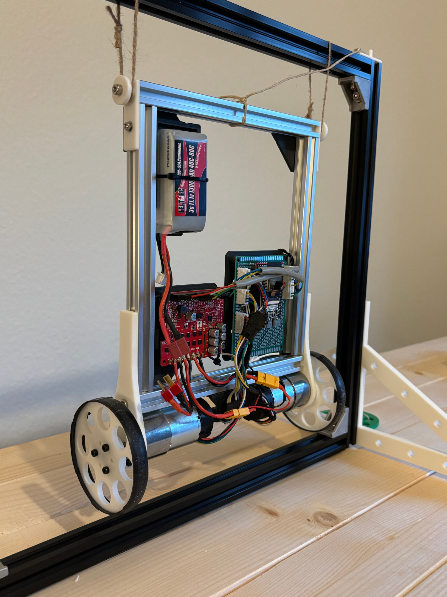

# Readme

Welcome to the project page for the self-balancing robot!

## Objectives

The goal of this project is to develop a robotic platform that can serve as a fun way to learn about various aspects of robotics, including classical and learning-based control, 3D vision and sensor fusion and modelling.

## Status

The robot has been built and is currently using PID control for pitch control. Pitch estimation works well. I am busy simulating the system and improving the controller using classical control methods.

Once I am satisfied with the classical controller (both PID and LQR), I will move onto the next phase of learning-based control.

The robot stting in its harness:

