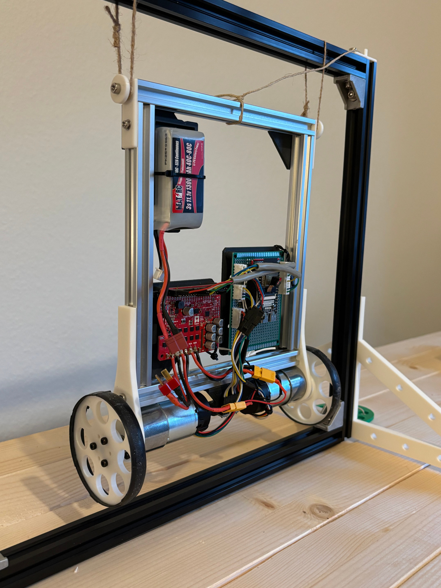

# Self-balancing robot

Welcome to the project page for the self-balancing robot!

## Objectives

The goal of this project is to develop a robotic platform that can serve as a fun way to explore various aspects of robotics, including classical and learning-based control, 3D vision, sensor fusion and modelling.

## Status

The robot has been built and is currently using PID control for pitch control. Pitch estimation works well. I am busy simulating the system and improving the controller using classical control methods.

Once I am satisfied with the classical controller (both PID and LQR), I will move onto the next phase of learning-based control.

## Project layout

- [Firmware](firmware/platformio_projects/self_balancing_robot/README.md): ESP32 controller, HTTP API, and PC serial reader. Earlier ESP-IDF work is in `firmware/archived/`.
- [Laptop dashboard](software/webserver/README.md): live controls and recording viewer.
- [Python scripts and simulation](software/python/README.md): calibration, plotting, recording conversion, and MuJoCo model.
- [Electronics](electronics/robot_pcb/): KiCad PCB files; [cable harnesses](electronics/cable_harnesses/README.md) are alongside them.
- [Mechanical design](mechanical/Readme.md): Onshape CAD link and printing notes.
- [Recorded data](data/data_logs/README.md): logs and example recordings; older data is in `data/archive/`.
- [Documentation](documentation/): supporting figures.

The robot sitting in its harness:

